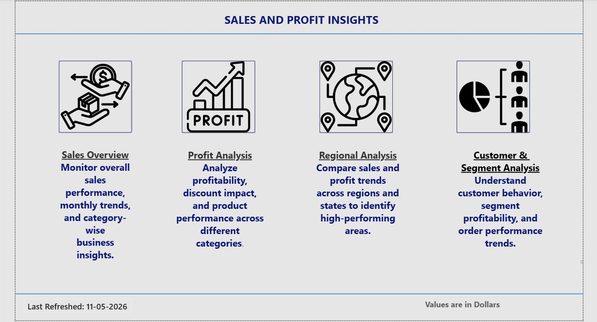
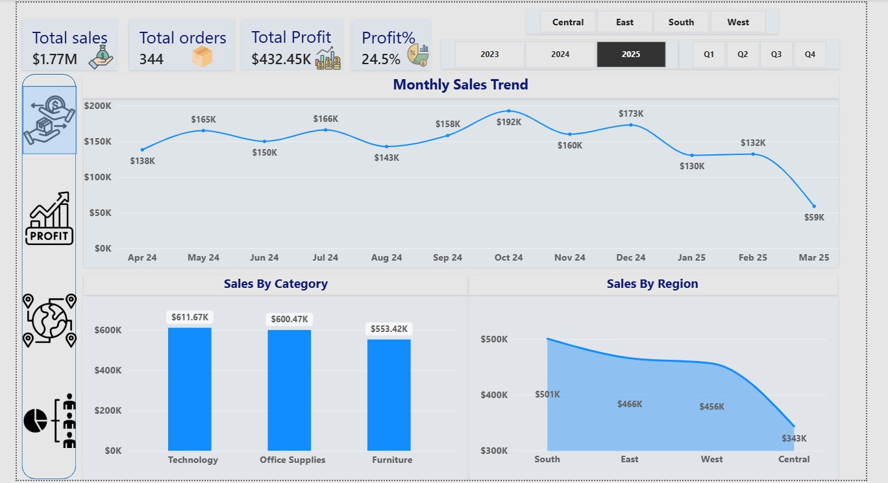
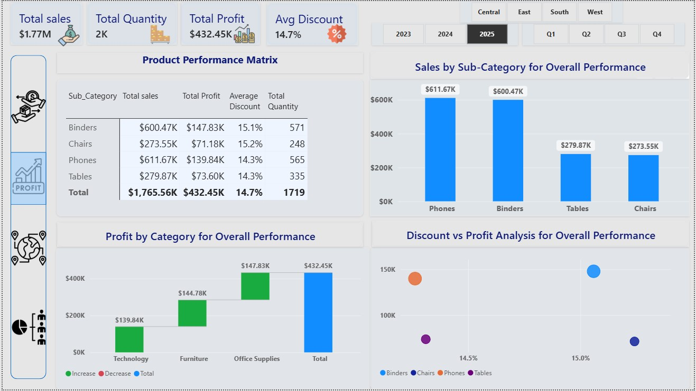
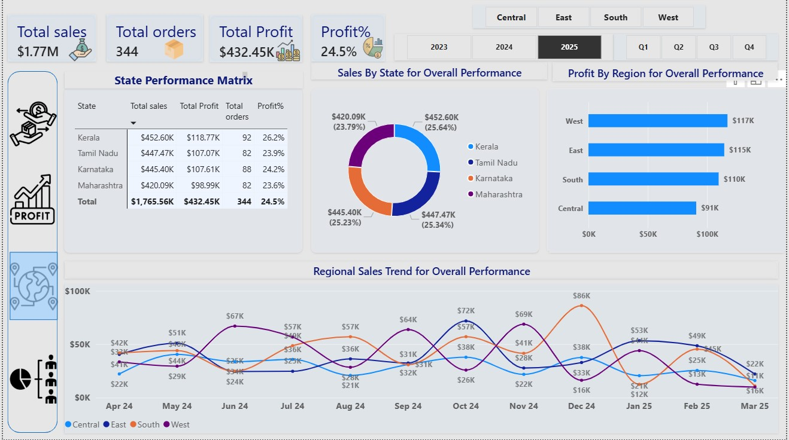
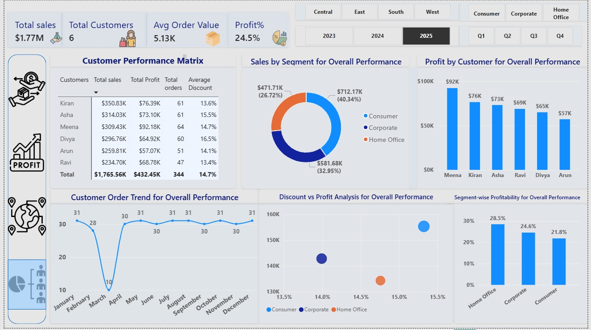

# 📊 Sales and Profit Insights Dashboard (Power BI)

## 📌 Overview
An interactive multi-page Power BI dashboard developed to analyze sales performance, profitability, regional trends, customer behavior, and segment-wise insights.

---

## 🛠️ Tools Used
- Power BI
- DAX
- Excel

---

## 🚀 Dashboard Features
- KPI Cards
- Dynamic Titles
- Interactive Slicers
- Regional Analysis
- Customer & Segment Analysis
- Scatter Plot Analysis
- Waterfall Chart
- Tooltips & Navigation Buttons

---

## 💡 Key Insights
- Identified high-performing regions
- Analyzed profitability trends
- Compared customer segments
- Evaluated monthly sales performance

---

## 📂 Files Included
- Power BI Dashboard (.pbix)
- Excel Dataset
- Dashboard Screenshots

---

## 🏠 Home Page

---

## 📊 Sales Overview

---

## 📈 Profit Analysis

---

## 🌍 Regional Analysis

---

## 👥 Customer & Segment Analysis

## ⚠️ Note
Open the PBIX file using the latest version of Power BI Desktop.
